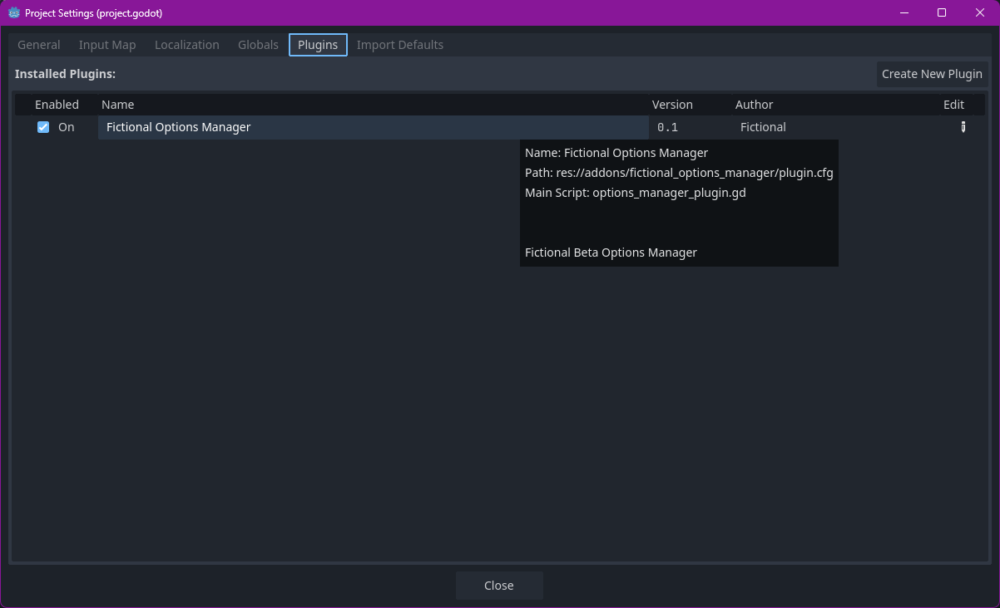
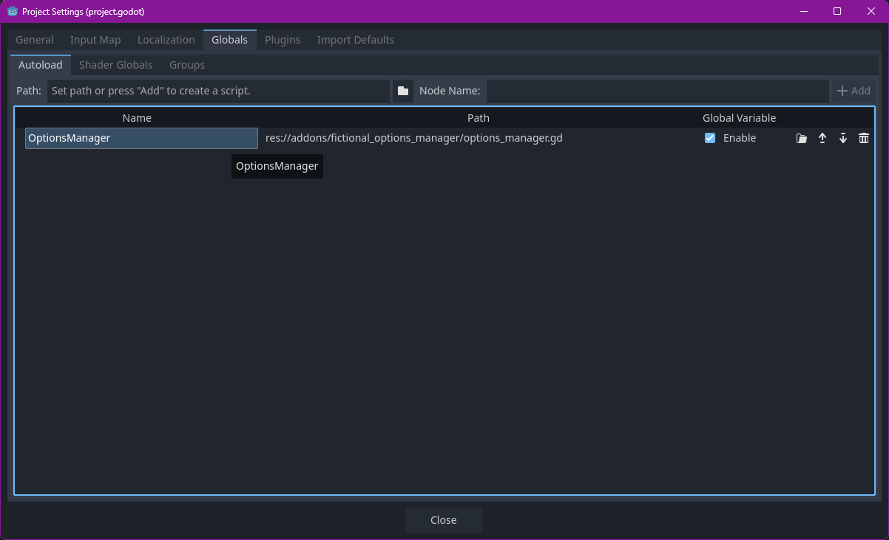
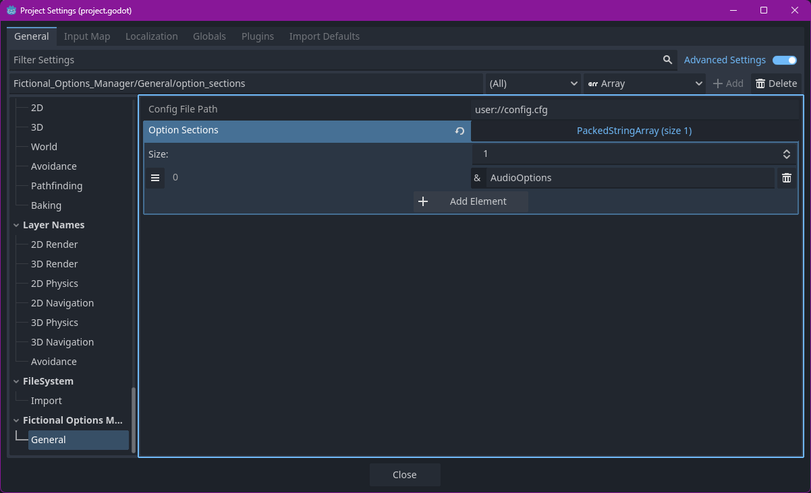

# Fictionals Godot Options Manager Scripts

Automatic Loading of Settings and Configuration from your user configuration
Created as a wrapper around the inbuilt Godot Configuration Files to load pre-defined and custom sections as well as provide a notifier for those options updating at runtime

---
## Installation

### Asset Lib
Download via asset lib and add the `fictional_options_manager` folder to the project

### Via Github 
Download Source and drag `./addons/fictional_options_manager` folder into the Addons folder in the Godot Project 

### Activate Plugin
Goto the Plugins tab of the Godot Project Settings
If addon has been added to the project correctly you should see the **Fictional Options Manager** added
Select the Enabled checkmark to activate the plugin

---
## Using the Options Manager
### Global Definition
If plugin activated correctly, you should have the OptionsManager global created for you.  This is the default one that should cover most basic uses

### Project Settings
Goto Project Settings &rarr; General &rarr; Scroll down &rarr; Fictional Options Manager &rarr; General

|Setting Name   | Use   | Example |
| :---          | :---  | :---  |
| Config File Path | The path to the settings file the running game will use | user://config.ini |
|Options Sections | An array of **Type Names** to add to the Configuration List | AudioOptions|

### How it Works
At runtime, the Options Manager will create an instance of each Type listed in the _Options Sections_ configuration.  It will then load the settings from the _config_file_path_ to the created sections

Each Section is stored in a dictionary keyed to the SectionName property, and will load the properties configured in thhe class

### Creating an Options Section

1. Create a new gd script file with the name of the options you are creating.  
   - SubjectOptions is a good baseline - E.G - AudioOptions, GraphicOptions, ControlOptions
2. Give the new class a Classname as the script file, and ensure to extend from `OptionsSection`
   - E.G `class_name AudioOptions extends OptionsSection`
3. Create the properties you would like to store as you would normally.  Backing fields are not required

        var MasterVolume: float = 100.0:
        get: return MasterVolume
        set(value): MasterVolume = value

4. Override the `_init` method, calling the base `_init` with the name of the section this OptionsFile represents
   
        func _init() -> void:
	        super._init("Audio")

5. Add the properties to the Key Map
   1. The **KEY** is the name of the setting from inside the configFile
   2. The **VALUE** is the `StringName` of the Property in the script file
   3. You can either add to the dictionary yourself, or use the convenience method to do so

            _config_key_map["GameMasterVolume"] = &"MasterVolume"
            addValue("GameMusicVolume", &"MusicVolume")

6. Review your properties and decide which ones you wish to force an immediate notification to be emited.  In the set of the property add a call to `notifiy_change`

        var MasterVolume: float = 100.0:
	    get: return MasterVolume
	    set(value):	
		    MasterVolume = value
		    notify_change()

7. A notification of the settings being updated will be sent in the following events -
   1. the `loadconfig` method - called when loading the values from the configuration
   2. the `apply` method - called from the options manager when `OptionsManager.save()` is called
   3. `notify_change` method is called manually

### Using the Options Manager

Assuming your Types have been added as per the Project Settings section above, you will only need to interact with the Options Manager in a few instances

+ Saving the Configuration
  + The `save_configuration()` method should be called when you want all the current local updates to be saved back to the filesystem and the updates to be pushed through the notifications
+ Binding to settings updates
  + Using the `bind_notifcation(name: StringName, callback:Callable)` method will add your callback to the configuration section with the section name
  + The name is Case Sensitive
  + The provided callback method should have 1 parameter, the type of the settings you wish to have, and should return void
   + Example Useage

         OptionsManager.bind_notifcation(&"Audio", update_audio_levels)
   + Example Callback Method Signature

         func update_audio_levels(options: AudioOptions) -> void:

---

## Code Examples

### Audio Options Examples
A full end to end example is provided in the `audio_options_implementation` folder, which is the method I have done my own AudioSettings in a number of Gamejams
The [AudioOptions](addons/fictional_options_manager/audio_options_implementation/audio_options.gd) (`audio_options.gd`) file defines a full options section for Audio, suitable for prototypes and game jams.
The [AudioManager](addons/fictional_options_manager/audio_options_implementation/audio_manager.gd) (`audio_manager.gd`) is intended to be used as a Global, and demonstrates how to bind to the signal for updated settings
Finally [AudioSettingsPanel](addons/fictional_options_manager/audio_options_implementation/audio_settings_panel.gd)`audio_settings_panel.gd` contains both the updating of the settings values and the notification process

### Other Examples
[Example Section](addons/fictional_options_manager/examples/example_options_section.gd) shows a brief example of how to extend the base `OptionsSection`
[Exmaple Second Options Manager](addons/fictional_options_manager/examples/example_second_config.gd) demonstrates how to create a second options manager using a different file and how to bind default options sections